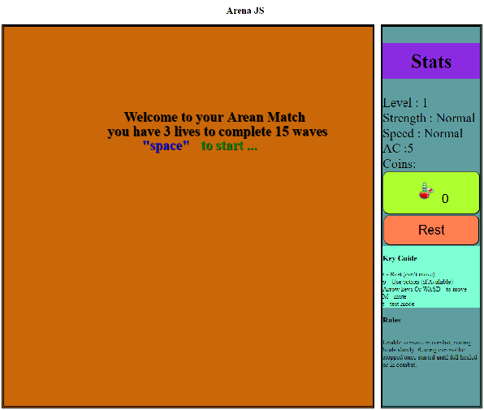
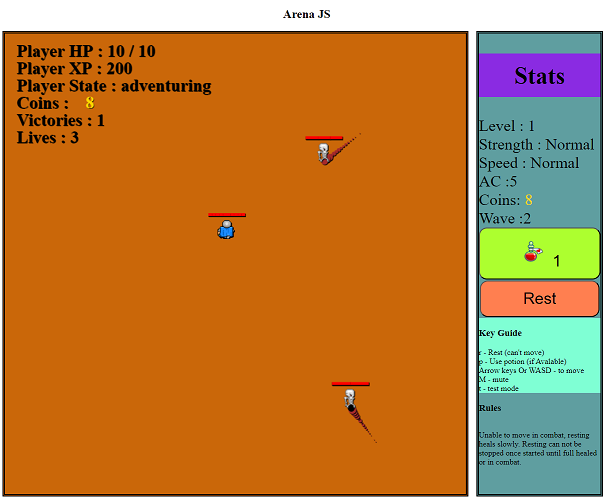
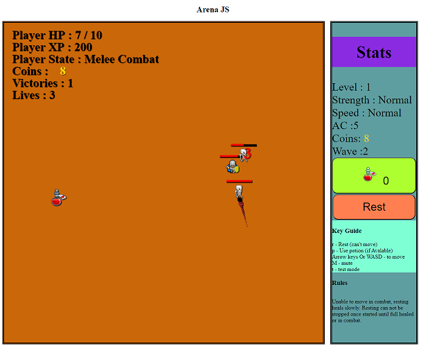

### Areana JS

  
this is a small java-script game i developed from the larger turn based Java game Dungeons FX i was building to learn Java.

  you simply collect potions to heal yourself as needed and figh the waves of monsters untill to reach round 15.

<h2>
  Monsters Features
</h2> 
<ul>
  <li>
    Orcs
  </li>
  <li>
    Trolls
  </li>
</ul>
<h3> 
  Monster ai 
</h3>

  Careful mosters will chase down potions if they are closer to them than you.

